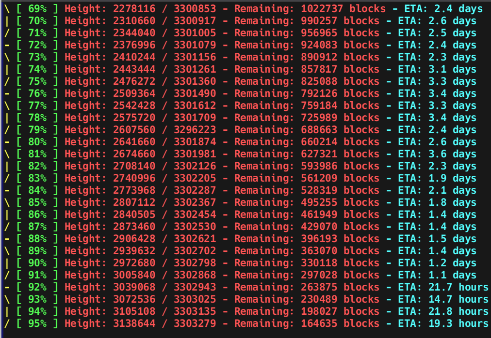

# WinMoneroSyncWatch

**WinMoneroSyncWatch** is a Windows-based PowerShell script to monitor the synchronization progress of a Monero node in real-time. It displays syncing stats in a clean, style-ish interface, with percentages, block heights, estimated time remaining, and more. 

This project was created because there wasn't a reliable and user-friendly Monero sync monitor for Windows users. It's tailored for those running a Monero daemon (`monerod`) and want a visual, real-time update of the sync process.

---

## Features

  - Current sync percentage.
  - Synced and total block heights.
  - Remaining blocks.
  - Estimated time left (ETA).
- Stalled sync detection with alerts and optional logging.
- Works out of the box with both default and custom Monero daemon log paths.
- Configurable timeout for stalled sync detection.
- Supports saving and reusing paths for ease of use.

---

## Prerequisites

1. A running Monero daemon (`monerod`).
   - Ensure the Monero software is downloaded and your node is syncing. 
   - By default:
   - Monero logs are saved at `C:\ProgramData\bitmonero\bitmonero.log`.

2. **PowerShell 5.1+** (Pre-installed on most Windows systems).

---

## Installation

1. Clone this repository:
   
   ```bash
   git clone https://github.com/locainin/WinMoneroSyncWatch 
   ```
2. (Optional) Verify the contents:

   ```bash
   cd WinMoneroSyncWatch
   ./MonitorMoneroSync.ps1
   ```
## Usage
Run the script in PowerShell:

   
  ```bash
  ./MonitorMoneroSync.ps1
 ```
## First-Time Setup:
You will be prompted to enter:
  - The path to your Monero log file 
  - Enter the path to save stalled sync logs

**These paths will be saved to sync_config.json for any future runs.**

## Screenshot Example


## Troubleshooting
  - Ensure your Monero daemon (`monerod`) is running and the log file exists at the specified path.
